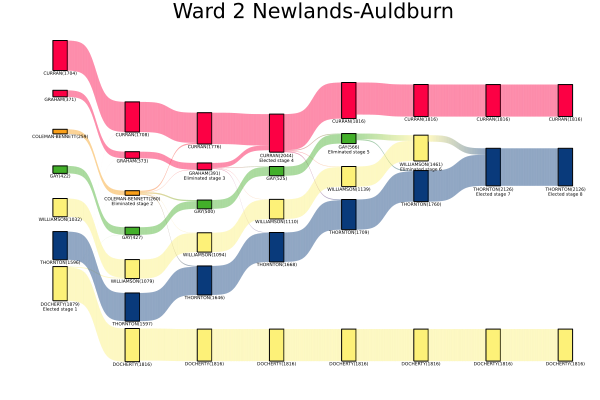

# STV

Simple implmentation of [Single Transferrable Vote](), as used in Glasgow, using raw data, in Julia.

*NOTE* there is a problem with this that's causing small differences between reported transfers and my calculations.

See [here](https://glasgow.gov.uk/index.aspx?articleid=21080) for the 2007 data.

